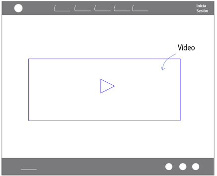
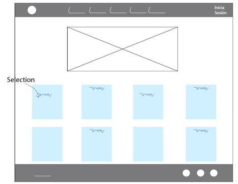
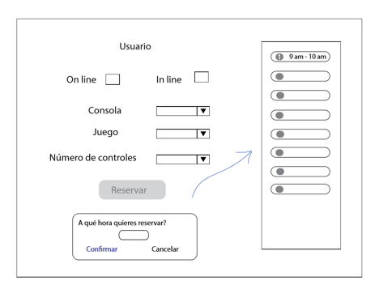
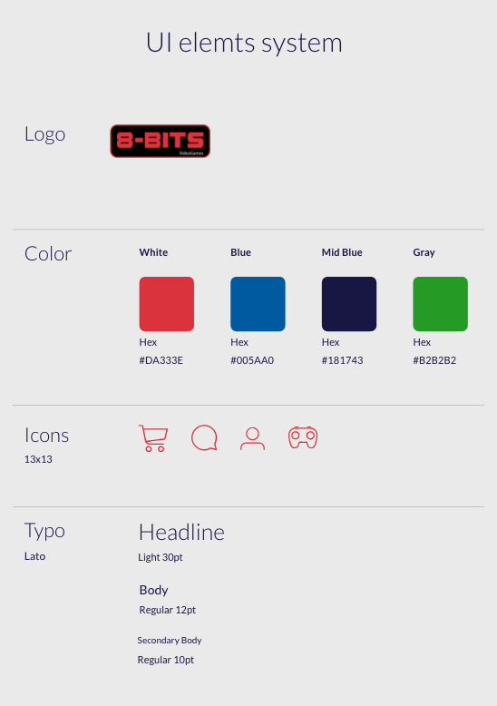
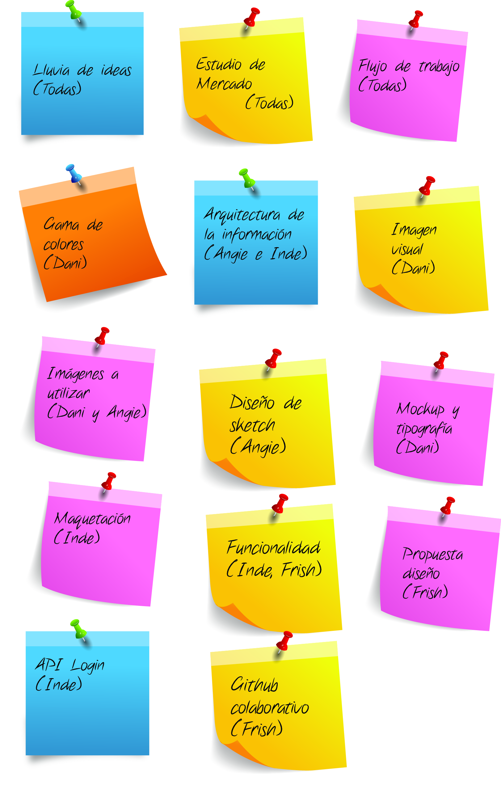
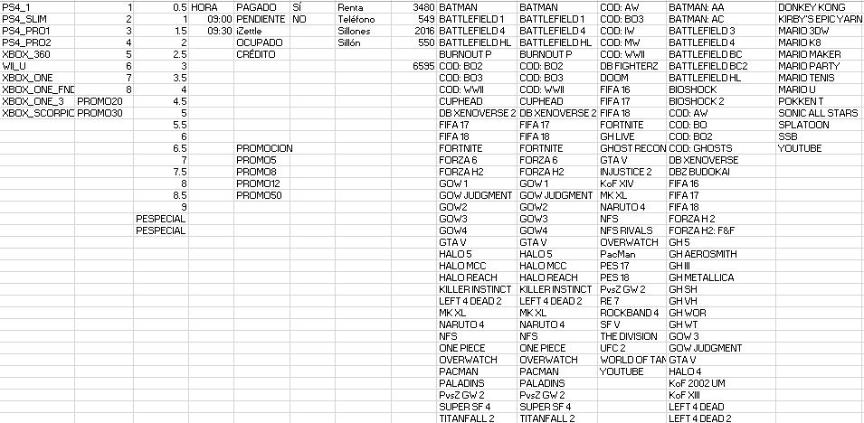

1. Sobre nuestro producto...

Es una Webapp para reserva de consolas de videojuegos.

2. Cómo se llegó a la idea

Detectamos un problema en cuanto a la administración que se maneja actualmente en los establecimientos de rentas de videojuegos, donde no es posible hacer una planificación correcta de los tiempos, espacios y recursos en beneficio de los usuarios.

3. Organización

* Hicimos lluvia de ideas para definir el producto a realizar
* Estudio de mercado para saber si existe algún producto similar
* Clasificamos la prioridad de las tareas de la siguiente manera:
  * Diseño web: Gama de colores, arquitectura de la información, imagen visual, flujo de usuario, imágenes a utilizar, diseño de sketch, diseño de mockup, definir tipografía,  
  * Maquetación: Definir el framework a utilizar: Bootstrap, generación de HTML y CSS
  * Funcionalidad. Definir las herramientas a utilizar: Javascript, jquery, generación de data, Firebase, Api de google para inicio de sesión, github colaborativo

4. Avance
  * Gama de colores OK
  * Arquitectura de la información OK
  * Imagen visual OK
  * Flujo de usuario OK
  * Imágenes a utilizar - En proceso
  * Diseño de sketch - OK
  * Diseño de mockup - En proceso
  * Tipografía - OK
  * Maquetación - NAV - OK
  * Funcionalidad: Data OK, Firebase funcionando, login en proceso.
  * Github colaborativo - OK

  ## Sketch

## Propuesta elementos UI

## Organización

## Base de datos - Guía

